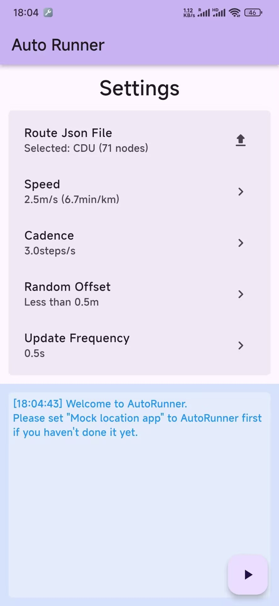
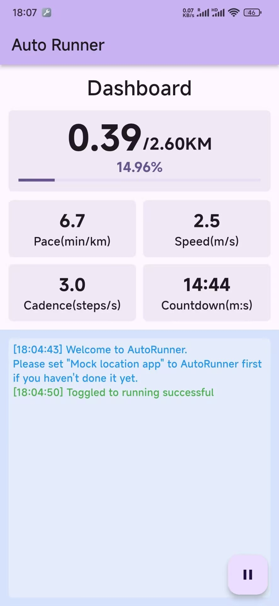

# Auto Runner
An Android(Flutter) application that can mock GPS location along a set route.
> Warning: This project is used for test GPS function on your **own** application, PLEASE DO NOT USE IT FOR ILLEGAL PURPOSE

## Screenshots

## Requirement
- Android device(At least Android 11)
- Xposed(Root)
- Settings `Dev options` -> `Location` -> `Select mock location app` -> `auto_runner`

## Route Json File
Before starting, you have to make or select a `Route Json File`. Its format is as follows.The values of `longitude` and `latitude` follow `WGS84` reference system.
```json
{
  "nodes": [
    {
      "longitude": 104.19430631773561,
      "latitude": 30.657094881112435
    },
    {
      "longitude": 104.19430631773561,
      "latitude": 30.657094881112435
    },
    //...
    {
      "longitude": 104.1978800954528,
      "latitude": 30.6564003955068
    }
  ],
  "name": "CDU"
}
```
And there is a tools in `python_tools/convertFL.py`. It can convert `Fake Location`'s route format to `Auto Runner`'s format.

## License
This software is available under the `GPLv3` open source license, which is summarized below.
- Free copying You can copy the software to your computer, your client's computer, or anywhere. There is no limit to the number of copies you can make.
- Distribute freely You can make it available for download on your web site, copy it to a USB flash drive and give it away, or print out the source code and throw it out the window (please don't do this for environmental reasons).
- Can be used for profit You can charge for distributing the software, but you must provide your customers with the GNU GPL license for the software before you do so, so that they know they can get it for free from another source, and the reason you are charging for it.
- Free to Modify If you want to add or remove a feature, no problem, if you want to use part of the code in another project, no problem, the only requirement is that the project that uses this code must also use the GPL agreement.
- If someone signs something of a contractual nature with the recipient and provides a liability commitment, the licensor and author are not subject to this liability collateral.